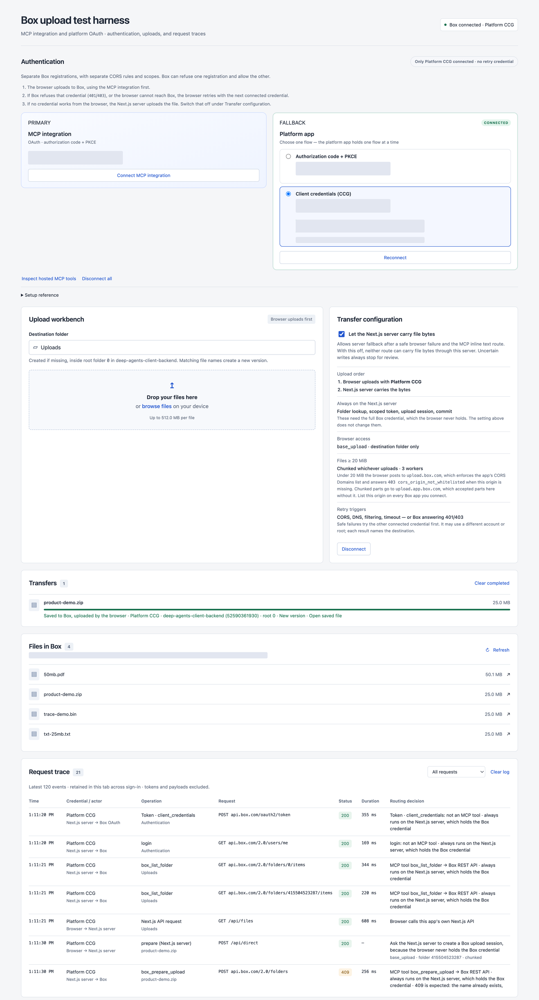

# Box upload test harness

Test file uploads and authentication with Box-hosted MCP, Platform OAuth (authorization code with PKCE), and Platform client credentials (CCG). The browser UI shows which account, API calls, and upload route each transfer uses.

<p align="center">
  <a href="docs/architecture.md"></a>
</p>

## Setup

Requires Node.js 22 or newer and at least one Box app.

```sh
npm install
cp .env.example .env
```

Register the apps you want to test, then set their credentials in `.env`:

| Box registration                                                                                                | Required variables                                                                             |
| --------------------------------------------------------------------------------------------------------------- | ---------------------------------------------------------------------------------------------- |
| [Custom MCP integration](https://developer.box.com/guides/box-mcp/setup)                                        | `BOX_MCP_CLIENT_ID`, `BOX_MCP_CLIENT_SECRET`                                                   |
| [Platform OAuth app](https://developer.box.com/guides/authentication/oauth2)                                    | `BOX_OAUTH_CLIENT_ID`, `BOX_OAUTH_CLIENT_SECRET`                                               |
| [Platform CCG app](https://developer.box.com/guides/authentication/client-credentials/client-credentials-setup) | `BOX_CCG_CLIENT_ID`, `BOX_CCG_CLIENT_SECRET`, and `BOX_CCG_ENTERPRISE_ID` or `BOX_CCG_USER_ID` |

- Enable file read/write access. Complete the enterprise authorization required by each registration. A non-empty `BOX_CCG_USER_ID` selects that user; otherwise CCG uses the enterprise service account.
- Register `http://127.0.0.1:3000/api/auth/callback` for MCP and Platform OAuth. CCG has no callback.
- Add `http://127.0.0.1:3000` to each app's CORS origins for browser uploads. If `APP_ORIGIN` changes, update both the origin and callback.
- For MCP binary uploads and text versions, an admin must enable `get_upload_url` and `upload_file_version`. See [Box tool access](https://developer.box.com/guides/box-mcp/tools).

Git ignores `.env`. Both the web app and standalone MCP server read it. Never prefix credentials with `NEXT_PUBLIC_`; that exposes them to the browser.

```sh
npm run dev
```

Open [127.0.0.1:3000](http://127.0.0.1:3000), connect an app, and choose a file.



## Upload behavior

MCP is primary when connected. A connected Platform OAuth or CCG app supplies the fallback credential; those two Platform flows replace each other. Selecting a radio button does not connect an app. To test one flow alone, select **Disconnect all**, then connect only that app.

| Path                                         | File transfer                                                                                         |
| -------------------------------------------- | ----------------------------------------------------------------------------------------------------- |
| MCP text, supported extension, up to 256 KiB | Server sends UTF-8 content in `upload_file` or `upload_file_version`.                                 |
| Other MCP files                              | Browser sends one POST to the URL from `get_upload_url`. No chunking.                                 |
| Platform, below 20 MiB                       | Browser sends one POST with a folder-restricted upload token.                                         |
| Platform, 20 MiB or more                     | Browser uploads parts of the size Box returns, using three workers; server verifies and commits them. |

The web app accepts non-empty files up to `MAX_UPLOAD_BYTES` (default 512 MiB). Box account limits also apply. **256 KiB is this harness's inline-text threshold, not a published Box limit.** See [file size limits and timeouts](docs/architecture.md#file-size-limits) for sources and unverified MCP limits.

### Fallback and uncertain results

The browser tries the next connected credential after an explicit 401/403, or a network failure during a chunked upload whose session was successfully aborted. It skips that credential for later files until **Retry browser upload** or reconnection.

**Let the Next.js server carry file bytes** allows the browser to send the file to Next.js for either of these reasons:

- **MCP text upload:** Next.js sends the file’s UTF-8 text inside a Box MCP tool call. This is the normal text-upload route, even when browser-to-Box uploads work.
- **Server fallback:** after the browser upload attempts fail safely, Next.js uploads the file using the selected Box credential.

In both cases, the browser first sends the file to Next.js. Next.js saves it on the disk of the computer running the app, reads it for the Box upload, and deletes the temporary copy after the attempt. MCP binary uploads through Next.js read the whole temporary file into memory.

With the checkbox off, neither case is allowed. Next.js still handles authentication and upload preparation, but it does not receive the file contents.

A lost POST response, failed commit, or failed abort stops the upload. Inspect Box before retrying: the file may already have been saved. Other HTTP errors also stop instead of changing credentials.

Fallback may use a different Box account or root folder. Each completed transfer names its destination and links to the file. The library lists only the primary account.

## Debugging

Expand a request-trace row for its credential, transport, status, timing, and error. **Inspect hosted MCP** shows tool descriptions and input schemas. Use the browser Network tab for CORS and connection failures; check the app named in the trace for `cors_origin_not_whitelisted`. For a missing saved file, follow its transfer link and check the account.

The trace keeps the latest 120 rows in this tab's session storage. **Clear** resets it. Headers, request bodies, cookies, and URL query strings are excluded from server trace events.

## Settings

| Variable                  | Default                             | Purpose                                                                                     |
| ------------------------- | ----------------------------------- | ------------------------------------------------------------------------------------------- |
| `APP_ORIGIN`              | `http://127.0.0.1:3000`             | Trusted browser origin; HTTPS required outside loopback.                                    |
| `BOX_USER_ROOT_FOLDER_ID` | `0`                                 | Root for MCP and Platform OAuth.                                                            |
| `BOX_CCG_ROOT_FOLDER_ID`  | `0`                                 | Root for CCG.                                                                               |
| `MAX_UPLOAD_BYTES`        | `536870912`                         | Web app's per-file limit in bytes.                                                          |
| `STAGING_DIR`             | `.staging` in the working directory | Temporary upload files on the Next.js host.                                                 |
| `APP_ACCESS_PASSWORD`     | unset                               | Optional CCG access password on loopback; at least 16 characters required outside loopback. |

Sessions live in the Next.js process; restarting it signs users out. See [architecture and operational limits](docs/architecture.md), [deployment constraints](docs/deployment.md), and [simplification candidates](docs/simplification-candidates.md).

## Checks

```sh
npm run typecheck
npm test
npm run format:check
npx playwright install chromium
npm run e2e
```

The browser suite builds the app and tests all three credentials against a Box REST/MCP simulator on this computer. It uses test credentials, not `.env` credentials. Coverage includes uploads, versions, hashes, pagination, fallback, uncertain writes, auth refresh, CSRF, and ownership. Live Box compatibility still needs verification in the workbench.

`npm run mcp` starts this project's separate stdio MCP server with CCG. `npm run e2e:live` writes real files under `e2e/` through that server; it does not test Box-hosted MCP. See [source layout and standalone use](docs/architecture.md#source-layout).
