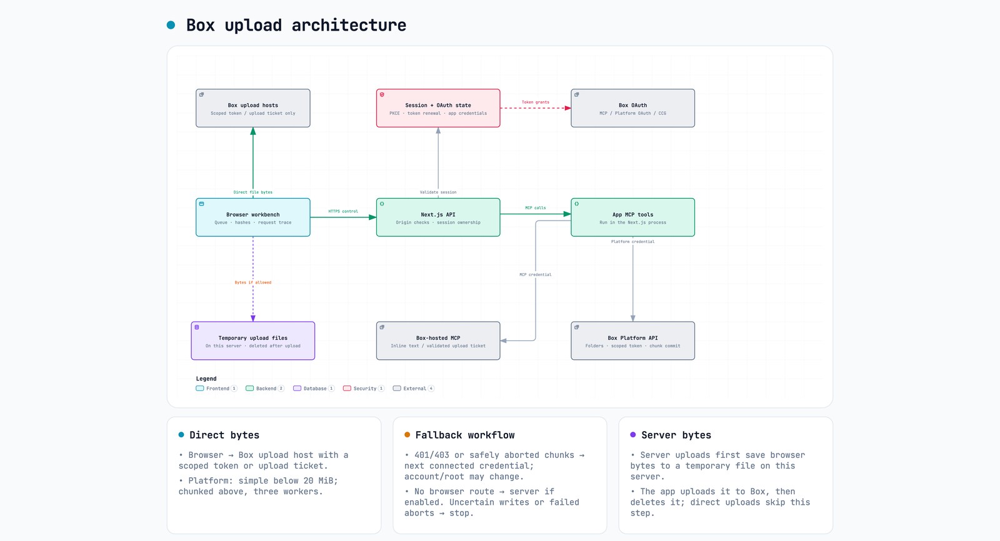

# Architecture

This harness compares three Box authentication paths — the Box MCP integration,
a platform OAuth app, and a platform CCG service account — and records every
request each one makes. The diagram in
[`diagrams/architecture.html`](diagrams/architecture.html) shows the components
and their connections. This document explains the trust boundary, the upload
paths, and how the harder facts below were verified.

The interactive version — theme toggle, zoom, path tracing — is
[`diagrams/architecture.html`](diagrams/architecture.html).

## Components

| Component | Role |
| --- | --- |
| Browser workbench | The page a person uses. It never holds a full Box credential. |
| Next.js API | This app's server. It holds the Box client secrets and every full token. |
| App MCP tools | Tool functions that run inside the Next.js process. They call Box for the platform OAuth and CCG credentials. |
| Box-hosted MCP | Box's own MCP server at `mcp.box.com`. Used only for the MCP integration credential. |
| Box Platform API | Box's REST API, used by the platform OAuth and CCG paths. |
| Box upload hosts | `upload.box.com` and `upload.app.box.com`, which receive the file bytes. |
| Temporary upload files | Browser bytes saved on the server only when a server upload is needed, then deleted. |
| Session and OAuth state | In-memory session, OAuth state, and single-use upload records. |

## Trust boundary

The client secret and every full or refresh token stay on the Next.js server.
The browser receives only a folder-restricted `base_upload` token or a single-use
upload ticket, and only when it is about to send bytes. A separate section of the
README, "Fallback and uncertain results," covers what the server still does when
browser uploads are turned off.

## Upload paths

The credential in use selects the path. The [README upload-routes table](../README.md#upload-routes)
lists each path's preparation, byte transfer, and finalization; the
[file-size-limits table](../README.md#file-size-limits) lists the limits. In
short:

- **MCP integration** — all work uses Box's published MCP tools. Small UTF-8
  text goes up inline with `upload_file` or `upload_file_version`. Every other
  file uses `get_upload_url`, then one POST of the bytes. No Box REST call is
  made on this path.
- **Platform OAuth and CCG** — the Box REST API. Files below 20 MiB use a
  single POST to `/files/content`; files at or above 20 MiB use a chunked
  upload session with 8 MiB parts.

## What "multipart" means on the MCP path

Box's blog and sequence diagram describe the `get_upload_url` transfer as a
"multipart upload over HTTP." This is the `multipart/form-data` encoding of one
HTTP request — the same encoding a browser form uses — not a chunked or
resumable upload. It sends the whole file in a single POST.

This was verified against Box's live MCP server, not inferred:

- Calling `get_upload_url` for a 1 KB file and for a 100 MB file both returned a
  URL on the **simple-upload** endpoint,
  `https://upload.app.box.com/api/2.0/files/content`, with a bound
  `upload_token`. The URL shape did not change with size.
- The URL carries an `upload_session_id` query parameter. This is a proxy-token
  binding on the simple-upload endpoint, not the chunked resource
  (`/files/upload_sessions/{id}`). Box's MCP server publishes no part, commit,
  session, or abort tool.

Consequences for large files on the MCP path: there is no per-part retry and no
resume, and the returned URL and token expire about 10 minutes after they are
issued. A slow transfer that outlives the token fails as a whole. Box benchmarked
this path only up to 20 MB in its blog; Box does not publish a maximum file size
for `get_upload_url`, and this harness did not complete a transfer above the
documented 50 MB simple-upload limit to test whether the proxy raises it.

Two conditions gate the MCP binary path regardless of file size:

- `get_upload_url` and `get_download_url` are off by default on the Box MCP
  server. An enterprise admin enables them under Admin Console → Integrations →
  Box MCP Server → Files and Folders → Custom Configuration.
- Some clients require allowlisting the upload hosts `upload.*.box.com`,
  `*.boxcloud.com`, and `*.box.com`.

## Cross-origin behavior

CORS enforcement differs by Box endpoint, which affects browser uploads:

- `POST /files/content` (simple upload) enforces the app's CORS Domains
  allow-list and returns `403 cors_origin_not_whitelisted` for an unlisted
  origin.
- The upload-session endpoints (`/files/upload_sessions`, and the part PUTs on
  `upload.app.box.com`) return `201`/`200` from an unlisted origin and reflect
  that origin with `Access-Control-Allow-Credentials: true`.

Because Box selects the upload host and endpoint by file size, a file below
20 MiB can be refused from the browser while a larger file to the same folder
with the same credential succeeds. When a browser upload is refused, the harness
retries with the other connected credential, then falls back to a server upload
if that is allowed.

## How key facts were verified

The behaviors above were confirmed empirically, holding the credential, folder,
and origin constant and changing one variable at a time:

- **MCP transport** — connected to `mcp.box.com` and called each tool; recorded
  the returned URLs and payload shapes.
- **CORS per endpoint** — sent the same downscoped token to `/files/content`,
  `/files/upload_sessions`, and a part PUT, from a listed origin and an unlisted
  origin, and compared status codes and response headers.
- **Upload-size routing** — read the harness thresholds from source
  (`CHUNKED_THRESHOLD` = 20 MiB, `TEXT_INLINE_LIMIT` = 256 KiB) and confirmed
  20 MiB is above Box's 20 MB session minimum.
